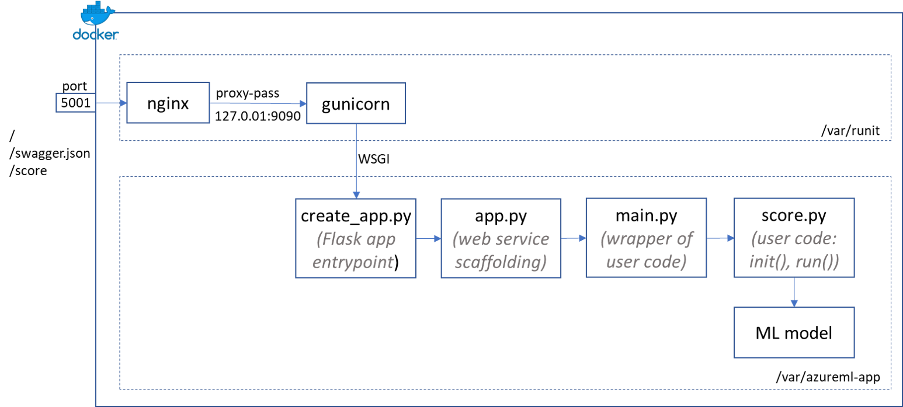

## Inside the Docker image built by Azure Machine Learning service

Azure Machine Learning (ML) service is a cloud-based environment that makes it easier for you to develop, train, test, deploy, and manage machine learning models. A model can be deployed as a web service that runs on Azure Container Instances, Azure Kubernetes Service, FPGAs, or as an IoT module that runs on Azure IoT Edge devices. In all these cases, the model, its dependencies, and its associated files are encapsulated in a Docker image which exposes a web service endpoint that receives scoring requests and returns inference results.

Using Azure Machine Learning Python SDK, you don't have to worry about how to create a web service that calls your model, or how to build a Docker image from a Dockerfile. Instead, you can create the Docker image as following:

```python
image_config = ContainerImage.image_configuration(
    execution_script = "score.py", #this file contains init and run functions that you implement
    runtime = "python",
    conda_file = "myenv.yml" #this file contains conda environment that the model depends on
    )
image = ContainerImage.create(
    name = "myimage", 
    models = [model], #this is the trained model object
    image_config = image_config,
    workspace = ws
    )
```

You can read up on how to create the model, the execution script, and the conda environment file in the [Azure ML documentation](https://docs.microsoft.com/en-us/azure/machine-learning/service/how-to-deploy-and-where). What's not in the documentation, however, is how everything is put together in the image to make the scoring web service work. Understanding how this works can help you troubleshoot or customize your code and your deployment.  

This is what's inside the Docker image:

*  Azure Machine Learning service wraps the "init" and "run" functions you put in the execution script in a [Flask](http://flask.pocoo.org/) application. Inside the image, all the code associated with this app is placed in the ```/var/azureml-app``` folder. ```create_app.py``` is the entrypoint of this app.  
*  Inside ```create_app.py```, there's a statement ```app.run(host='0.0.0.0', port=9090)```. So if you just run ```python create_app.py```, you'll be able to connect to http://<span></span>localhost:9090 with three routes:
    *  ```/```: returns "Healthyroot" if the app runs
    *  ```/swagger.json```: returns swagger for the web service apis
    *  ```/score```: returns the scoring results
*  Running web service directly on Flask is not a good practice in prodcution, because Flask is not a web server built for large scale, it handles request sequentially. Instead, [gunicorn](https://gunicorn.org/) is placed in front of the Flask app to handle requests. gunicorn is a Python WSGI HTTP server that leverages pre-fork worker model to effciently handle multiple requests in parallel. gunicorn configuration is placed in ```/var/azureml-app/gunicorn_conf.py```, and you can see it's bind to ```127.0.0.1:9090```. The Flask app is started by gunicorn rather than standalone. Otherwise, they can't both be listening on port 9090.
*  gunicorn is started by [runit](http://smarden.org/runit/), a UNIX init scheme that runs services on boot. If you "docker inspect" the Azure ML created image, it has this startup CMD ```runsvdir /var/runit```, which means it monitors subfolders of ```/var/runit```, and if a subfolder has a ```run``` file in it, it will execute that file. In this image, there's a ```/var/runit/gunicorn/run```, which runs ```gunicorn -c gunicorn_conf.py wsgi:app``` in ```/var/azureml-app```.
*  While gunicorn can handle multiple requests in parallel, it doesn't have all the capabilities of a web server built for large scale production workload. This is where Nginx comes in. Among many other capabilities, Nginx can process static files and deal with slow clients by caching results so that gunicorn threads can be quickly freed up for additional requests as soon as backend Python processing is done. In this image, nginx is also started by runit under ```/var/runit/nginx```. From its configuration file in ```/etc/nginx/sites-available/app```, you can see it's configured to listen on port 5001, and proxy_pass to ```127.0.0.1:9090``` which is where gunicorn listens on. Now as long as we export port 5001 of the Docker container running this image, we should be able to access the scoring web service endpoint.

