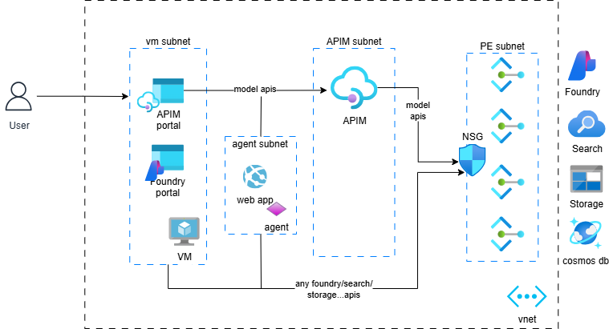
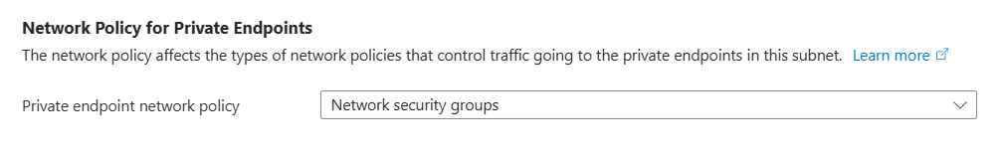

# Azure API Management and Azure AI Foundry in a virtual network

You can [import Azure AI Foundry model endpoints to API Management](https://learn.microsoft.com/en-us/azure/api-management/azure-ai-foundry-api)
as APIs. To set this up in an enterprise grade secure environment
requires knowledge across AI Foundry, API Management (APIM), networking,
private endpoint and more.

In this post, we document how to set up
API Management in [Virtual Network Internal mode](https://learn.microsoft.com/en-us/azure/api-management/api-management-using-with-internal-vnet) that communicates
with a [network secured AI Foundry environment](https://learn.microsoft.com/en-us/azure/ai-foundry/agents/how-to/virtual-networks).

We will create a simplified sample environment and test a few
scenarios in a VM deployed in the vnet:


## Create a network secured AI Foundry environment

Secure AI Foundry environment diagram.


__Motivation__: A secured AI Foundry environment places all AI Foundry and related
services behind private endpoints. Azure AI Agents are placed in
a subnet in the same vnet as the private endpoints. This way, only

- Azure AI Agents
- Applications running inside the vnet,
- clients connected to the vnet through VPN, Bastion, or ExpressRoute

can access AI Foundry services.

__Implementation__: You can use [this bicep template](https://github.com/azure-ai-foundry/foundry-samples/blob/main/samples/microsoft/infrastructure-setup/15-private-network-standard-agent-setup/README.md) to create the environment.

__Validation__: Once the environment is created, you can go to AI Foundry portal from outside the vnet, try, for example, the playground in AI Foundry, and you will not be able to access it.

If you create a VM within the VNet and try the same from the VM,
you will be able to access AI Foundry.

## Create an API Management instance in virtual network internal mode

API Management in virtual network internal mode diagram


__Motivation__: APIs exposed by API Management can only be accessed
within the vnet. Both on-premises and cloud-based APIs can be exposed
through API Management.

__Implementation__: You can create this environment by going to the
Azure portal and follow the wizard to create an API Management instance.
However there are several things to pay attention to if you are new to
setting up this environment:

- Create a subnet in the same vnet as AI Foundry that will be dedicated
to this API Management.
- Create a NSG and associate it with the subnet. The inbound [NSG rules](https://learn.microsoft.com/en-us/azure/api-management/api-management-using-with-internal-vnet#configure-nsg-rules)
must include the following, simply allowing `VirtualNetwork` to `VirtualNetwork` is not sufficient:
  - Allow `ApiManagement` service tag to `VirtualNetwork` port 3443
  - Allow `AzureLoadBalancer` service tag to `VirtualNetwork` port 6390
- [Configure DNS private zone](https://learn.microsoft.com/en-us/azure/api-management/api-management-using-with-internal-vnet#dns-configuration)
 for the API Management endpoints. Otherwise, you won't be able to
 launch the developer portal.

__Validation__: You cannot access any of the API Management endpoints,
such as the developer portal, from the Internet. However, you can
access them from a VM inside the VNet.

## Expose AI Foundry model endpoints as API Management APIs

Go to API Management in the Azure portal and
 [import an AI Foundry API](https://learn.microsoft.com/en-us/azure/api-management/azure-ai-foundry-api).

Before you can test it, configure the backend url and authentication:

- In the APIM Azure portal, go to the `Settings` tab of your API,
set the `Web service URL` to the AI Foundry model endpoint, for example,
`https://<my-ai-foundry>.cognitiveservices.azure.com/openai/deployments/gpt-4o`.
The format of the URL varies based on your choice of Azure AI
or OpenAI compatible APIs.
- To simplify testing, we will use the API Management System Managed
Identity to call the API.
  - Grant the MSI `Cognitive Services OpenAI User` role on AI Foundry.
  - In the APIM Azure portal, go to your API and select `All Operations`,
   in the `Design` tab, set the `authentication` policy:

  ```xml
  <authentication-managed-identity resource="https://ai.azure.com" output-token-variable-name="msi-access-token" ignore-error="false" />
  <set-header name="Authorization" exists-action="override">
    <value>@("Bearer " + (string)context.Variables["msi-access-token"])</value>
  </set-header>
  ```

__Testing__

- In the APIM portal, go to your API, select the `Test` tab, and make a call
such as a chat completion.
- Write a simple AI Foundry agent app to test that you can access Foundry
agents.
- Go to the AI Foundry portal playground to validate you can call the model APIs.
- Optionally write a web app or container app, deploy to the agent subnet and verify if it can call Foundry APIs.

NSG may be disabled on the private endpoints subnet. You can enable it
by editing the subnet in the Azure portal:

You can then play with enabling disabling traffic from different sources to
the private endpoints subnet to observe the behavior of API calls made through
API Management, AI Foundry portal, and custom app respectively.

You might think it'll be nice to force all LLM calls to go through API Management.
However you can test and see this is not quite possible at the moment. This is
because only AI Foundry model endpoints are exposed through API Management APIs,
not Agent services or other services that applications or AI Foundry portal also use.
