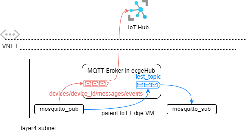

# How to use Azure IoT Edge MQTT Broker in Nested Edge

Azure IoT Edge has a [MQTT Broker](https://docs.microsoft.com/en-us/azure/iot-edge/how-to-publish-subscribe?view=iotedge-2020-11) built in that allows applications on the same edge device or other devices to publish and subscribe messages. The messages can also be sent to Azure IoT Hub using the Azure IoT Edge hub. This article demonstrates how to set up MQTT clients in nested edge scenarios to allow the child edge which doesn't have Internet connection to send MQTT messages through its parent to Azure IoT Hub.

> * Azure IoT Edge MQTT Broker is still in preview at the time of this writing (Apr 2022).
> * [Azure IoT Hub also has MQTT Broker support](https://docs.microsoft.com/en-us/azure/iot-hub/iot-hub-mqtt-support), which is separate from Azure IoT Edge MQTT Broker. This article focuses on the latter. 


## Scenario 1: Publish and subscribe messages on the parent edge to user defined topics with TLS
The simplest use case is to run MQTT client on an IoT Edge device to publish and subscribe messages to a user defined topic without TLS, as depicted in the blue path in the following diagram. [This article](https://docs.microsoft.com/en-us/azure/iot-edge/how-to-publish-subscribe?view=iotedge-2020-11#symmetric-keys-authentication-without-tls) documents exactly the steps required.



The following steps explain how to enable this scenario with TLS. It's important to note the enabling TLS is agnostic from enabling client certificate authentication. It looks like at the time of this writing, client certificate authentication is not supported. Instead, we use symmetric key authentication with TLS.

1. Generate identity certificates for the MQTT client devices pub_client and sub_client. For example, you can [create test certificates for the devices](https://docs.microsoft.com/en-us/azure/iot-edge/how-to-create-test-certificates?view=iotedge-2020-11#linux-3).

2. [Create the sub_client and pub_client devices in IoT Hub using X.509 self-signed certificates](https://docs.microsoft.com/en-us/azure/iot-edge/how-to-authenticate-downstream-device?view=iotedge-2020-11#x509-self-signed-authentication).

3. Set the the devices' parents to the IoT Edge device:
```bash
az iot hub device-identity parent set --device-id  sub_client --hub-name <iot_hub_name> --pd <edge_device_id>
az iot hub device-identity parent set --device-id  pub_client --hub-name <iot_hub_name> --pd <edge_device_id>
```

4. Generate a sas token for each device: 
```bash
az iot hub generate-sas-token -n <iot_hub_name> -d sub_client --key-type primary --du 3600
az iot hub generate-sas-token -n <iot_hub_name> -d pub_client --key-type primary --du 3600
```

5. On the devices running MQTT client, trust the root certificate of the MQTT Broker on IoT Edge. For example:
```bash
sudo cp /path/to/azure-iot-test-only.root.ca.cert.pem /usr/local/share/ca-certificates/azure-iot-test-only.root.ca.cert.pem.crt
sudo update-ca-certificates
```

6. Assuming you have configured edgeHub MQTT authorization policy as [this sample](https://docs.microsoft.com/en-us/azure/iot-edge/how-to-publish-subscribe?view=iotedge-2020-11#authorize-publisher-and-subscriber-clients), run the following commands on the respective MQTT clients:
```bash
# MQTT_BROKER_HOSTNAME is the name used when generating the IoT Edge identity certificate, ex. edge4.contoso.com
mosquitto_pub -t "test_topic" -i "pub_client" -u "<IOT_HUB_NAME>.azure-devices.net/pub_client/?api-version=2018-06-30" -P "<SAS_TOKEN_GENERATED_FOR pub_client>" -h "<MQTT_BROKER_HOSTNAME>" -V mqttv311 -p 8883 --cafile /path/to/root_ca.crt -m "helloTLS" 

mosquitto_sub -t "test_topic" -i "sub_client" -u "<IOT_HUB_NAME>.azure-devices.net/sub_client/?api-version=2018-06-30" -P "<SAS_TOKEN_GENERATED_FOR sub_client>" -h "<MQTT_BROKER_HOSTNAME>" -V mqttv311 -p 8883 --cafile /path/to/root_ca.crt
```

## Scenario 2: Publish messages from the parent edge to IoT Hub

## Scenario 3: Publish and subscribe messages on the child edge to user defined topics

## Scenario 4: Publish messages from the child edge through the parent to IoT Hub

## Summary
