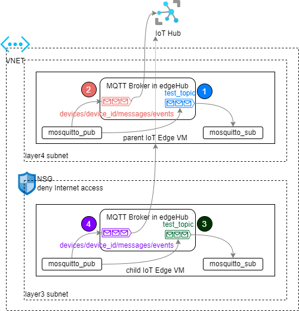

# How to use Azure IoT Edge MQTT Broker in Nested Edge

Azure IoT Edge has a [MQTT Broker](https://docs.microsoft.com/en-us/azure/iot-edge/how-to-publish-subscribe?view=iotedge-2020-11) built in that allows applications on the same edge device or other devices to publish and subscribe messages. The messages can also be sent to Azure IoT Hub using the Azure IoT Edge hub. This article demonstrates how to set up MQTT clients in nested edge scenarios to allow the child edge which doesn't have Internet connection to send MQTT messages through its parent to Azure IoT Hub.

> * Azure IoT Edge MQTT Broker is still in preview at the time of this writing (Apr 2022).
> * [Azure IoT Hub also has MQTT Broker support](https://docs.microsoft.com/en-us/azure/iot-hub/iot-hub-mqtt-support), which is separate from Azure IoT Edge MQTT Broker. This article focuses on the latter. 

The numbers in the following diagram indicates the 4 scenarios described in this article.



## Scenario 1: Publish and subscribe messages on the parent edge to user defined topics with TLS
The simplest use case is to run MQTT client on an IoT Edge device to publish and subscribe messages to a user defined topic without TLS, as depicted in the blue path in the above diagram. [This article](https://docs.microsoft.com/en-us/azure/iot-edge/how-to-publish-subscribe?view=iotedge-2020-11#symmetric-keys-authentication-without-tls) documents exactly the steps required. The following steps explain how to enable this scenario with TLS. 

> It's important to note the enabling TLS is agnostic from enabling client certificate authentication, using, for example, `mosquitto_pub --cert <CLIENT_CERT> --key <CLIENT_CERT_KEY>`. At the time of this writing, client certificate authentication does not seem to be supported. Instead, we use symmetric key authentication with TLS.

1. Generate identity certificates for the MQTT client devices pub_client and sub_client. For example, you can [create test certificates for the devices](https://docs.microsoft.com/en-us/azure/iot-edge/how-to-create-test-certificates?view=iotedge-2020-11#linux-3).

2. [Create the sub_client and pub_client devices in IoT Hub using X.509 self-signed certificates](https://docs.microsoft.com/en-us/azure/iot-edge/how-to-authenticate-downstream-device?view=iotedge-2020-11#x509-self-signed-authentication).

3. Set the the devices' parents to the IoT Edge device:
```bash
az iot hub device-identity parent set --device-id  sub_client --hub-name <iot_hub_name> --pd <edge_device_id>
az iot hub device-identity parent set --device-id  pub_client --hub-name <iot_hub_name> --pd <edge_device_id>
```

4. Generate a sas token for each device: 
```bash
az iot hub generate-sas-token -n <iot_hub_name> -d sub_client --key-type primary --du 3600
az iot hub generate-sas-token -n <iot_hub_name> -d pub_client --key-type primary --du 3600
```

5. On the devices running MQTT client, trust the root certificate of the MQTT Broker on IoT Edge. For example:
```bash
sudo cp /path/to/azure-iot-test-only.root.ca.cert.pem /usr/local/share/ca-certificates/azure-iot-test-only.root.ca.cert.pem.crt
sudo update-ca-certificates
```

6. Assuming you have configured edgeHub MQTT authorization policy as [this sample](https://docs.microsoft.com/en-us/azure/iot-edge/how-to-publish-subscribe?view=iotedge-2020-11#authorize-publisher-and-subscriber-clients), run the following commands on the respective MQTT clients:
```bash
# MQTT_BROKER_HOSTNAME is the name used when generating the IoT Edge identity certificate, ex. edge4.contoso.com
mosquitto_pub -t "test_topic" -i "pub_client" -u "<IOT_HUB_NAME>.azure-devices.net/pub_client/?api-version=2018-06-30" -P "<SAS_TOKEN_GENERATED_FOR pub_client>" -h "<MQTT_BROKER_HOSTNAME>" -V mqttv311 -p 8883 --cafile /path/to/root_ca.crt -m "helloTLS" 

mosquitto_sub -t "test_topic" -i "sub_client" -u "<IOT_HUB_NAME>.azure-devices.net/sub_client/?api-version=2018-06-30" -P "<SAS_TOKEN_GENERATED_FOR sub_client>" -h "<MQTT_BROKER_HOSTNAME>" -V mqttv311 -p 8883 --cafile /path/to/root_ca.crt
```

## Scenario 2: Publish messages from the parent edge to IoT Hub
In this scenario the MQTT client publishes messages to Azure IoT Hub through the MQTT Broker in edgeHub. The settings are identical to Scenario 1, with or without TLS, except that the topic has to be `devices/<DEVICE_ID>/messages/events`.

1. Publish to IoT Hub through MQTT Broker on the edge with TLS:
```bash
mosquitto_pub -t "devices/pub_client/messages/events/" -i "pub_client" -u "<IOT_HUB_NAME>.azure-devices.net/pub_client/?api-version=2018-06-30" -P "<SAS_TOKEN_GENERATED_FOR pub_client>" -h "<MQTT_BROKER_HOSTNAME>" -V mqttv311 -p 8883  --cafile /path/to/root_ca.crt -m "helloIoTHub"
```
2. Use a tool such as VSCode to listen on IoT Hub default endpoints, and you'll see the message from pub_client.
3. To publish to different topics to IoT Hub, add a sub topic such as `devices/pub_client/messages/events/sub_topic`, and the message will show up in IoT Hub with a property with the name of the sub topic and empty value.

> Note that if you don't see MQTT messages from IoT Edge, check if you defined any custom routes to route messages to, for example, Blob storage. In that case, the messages will show up in their route destination instead of the default endpoint.

## Scenario 3: Publish and subscribe messages on the child edge to user defined topics without TLS

1. Add a child edge that's isolated from the Internet and configure it as a child to the parent edge.

2. Complete steps 1 to 5 in Scenario 1 on the child edge. Ensure the MQTT clients are now children of the child edge.

3. Configure edgeHub MQTT authorization policy as [this sample](https://docs.microsoft.com/en-us/azure/iot-edge/how-to-publish-subscribe?view=iotedge-2020-11#authorize-publisher-and-subscriber-clients) on the child edge. Note that even though MQTT client doesn't send messages directly to the MQTT Broker in the parent edge any more, the parent edge must still have MQTT authorization policy defined.

4. Run the following commands on the respective MQTT clients on the child edge:

```bash
# MQTT_BROKER_HOSTNAME is the name used when generating the IoT Edge identity certificate, ex. edge4.contoso.com
mosquitto_pub -t "test_topic" -i "pub_client" -u "<IOT_HUB_NAME>.azure-devices.net/pub_client/?api-version=2018-06-30" -P "<SAS_TOKEN_GENERATED_FOR pub_client>" -h localhost -V mqttv311 -p 1883 -m "hello child edge"

mosquitto_sub -t "test_topic" -i "sub_client" -u "<IOT_HUB_NAME>.azure-devices.net/sub_client/?api-version=2018-06-30" -P "<SAS_TOKEN_GENERATED_FOR sub_client>" -h localhost -V mqttv311 -p 1883
```

## Scenario 4: Publish messages from the child edge through the parent to IoT Hub
This scenario is similar to Scenario 2. The key is that the MQTT client is sending messages to the topic `devices/<DEVICE_ID>/messages/events` on the child edge.

1. Publish to IoT Hub through MQTT Broker on the child edge without TLS:
```bash
mosquitto_pub -t "devices/pub_client/messages/events/" -i "pub_client" -u "<IOT_HUB_NAME>.azure-devices.net/pub_client/?api-version=2018-06-30" -P "<SAS_TOKEN_GENERATED_FOR pub_client>" -h localhost -V mqttv311 -p 1883
```

2. Use a tool such as VSCode to listen on IoT Hub default endpoints, and you'll see the message from pub_client.

## Summary
Using MQTT Broker in Azure IoT Edge enables the following capabilities:
* publishes/subscribes messages to/from user defined topics in MQTT Broker on the edge in a module or as a device.
* publishes messages through the MQTT Broker on the edge to IoT Hub.
* publishes messages on an Internet isolated child edge device through a parent edge to IoT Hub.
* supports pub/sub with or without TLS

The following capabilities are not supported at the time of writing:
* subscribe to topics specific to IoT Hub such as `devices/pub_client/messages/events/`.
* client cert authentication in MQTT Broker.
