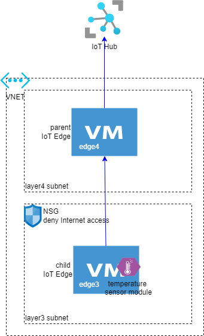

# Lessons learned from setting up Azure IoT Nested Edge with X.509 Certificates

Manufacturing customers often run their workload on the factory floor in networks that follow ISA-95 standard - machines on the lower layer don't have Internet access and can only communicate with machines a layer directly above. Additionally, manufacturing customers often have strict security requirements that only allow for certificate based authentication. Azure IoT Edge supports connecting a hierarchy of edge devices with the lower layer devices in an isolated network connecting to a top layer edge device acting as a gateway.

[Tutorial: Create a hierarchy of IoT Edge devices](https://docs.microsoft.com/en-us/azure/iot-edge/tutorial-nested-iot-edge?view=iotedge-2020-11) uses the `iotedge-config` tool to automatically provision and configure the devices. Not being an IoT expert, I wanted to manually provision and configure a nested edge environment, using certificates for authentication where possible, so I can better understand how things work. I ran into a few issues where no readily available answers can be found on the Internet. In hindsight, they are mostly due to some confusing certificate related terminologies and my lack of understanding of how Azure IoT Hub and Edge work when it comes to authentication. Hope this blog will help others on the same journey.

## The scenario to build

The goal is to create 2 edge devices, one in a subnet with Internet access (the __parent__ edge device), and another in an isolated subnet that doesn't have Internet access (the __child__ edge device). Configure them such that we can see their status as if they are both connected to Azure IoT Hub, and the messages sent from a module on the child edge can go through the parent edge to IoT Hub.



We can build this out in Azure with VNET and VMs. Here are the main steps:

1. Create a VNET with 2 subnets, `layer3` and `layer4`.
2. Create 2 Ubuntu VMs, `edge3` in `layer3` subnet and `edge4` in `layer4` subnet. [Install Azure IoT Edge on both machines](https://docs.microsoft.com/en-us/azure/iot-edge/how-to-provision-single-device-linux-symmetric?view=iotedge-2020-11&tabs=azure-portal#install-iot-edge). Note that here we only install the bits, not yet register the devices to Azure.
3. Add a Network Security Group rule to `layer3` subnet that denies all inbound and outbound Internet connection. Verify that `edge3` can no longer `curl` any public web site, for example, `curl https://www.google.com` will fail.
4. [Generate demo certificates](https://docs.microsoft.com/en-us/azure/iot-edge/how-to-create-test-certificates?view=iotedge-2020-11). Note that for nested edge to work, the edge hostname used for registering devices must be FQDN or IP. The CN in the certificates must match the hostnames. So we'll pass FQDN to the certificate generation commands.
5. Register both the parent edge `edge4` and the child edge `edge3` to IoT Hub with the generated certificates.
6. [Configure the parent edge as a gateway](https://docs.microsoft.com/en-us/azure/iot-edge/how-to-connect-downstream-iot-edge-device?view=iotedge-2020-11&tabs=azure-portal), and connect `edge3` as a child of `edge4`.
7. Deploy the [simulated temperature sensor](https://azuremarketplace.microsoft.com/en-us/marketplace/apps/azure-iot.simulated-temperature-sensor?tab=overview) to `edge3` and verify the messages are received in IoT Hub.

## Lessons learned

Most of the above steps are straightforward by following Azure documentations. The confusion is mostly around step 5. The document [Configure gateways for IoT Edge devices](https://docs.microsoft.com/en-us/azure/iot-edge/how-to-connect-downstream-iot-edge-device?view=iotedge-2020-11&tabs=azure-portal) assumes both parent and child edges are already registered, and therefore focuses on configuring the parent-child relatioship. But how do I register the edge devices with CA signed certificates, and when the child edge has no Internet connection?

### Self-signed vs. (private or enterpise) CA signed certificates

My understanding is that a __self-signed__ certificate is not signed with _any_ authority, which is different from a certificate signed by a private or enterprise authority. The latter is still a __CA-signed__ certificate even though the CA is not a trusted commericial certificate authority such as Baltimore, Verisign, Digicert, or GlobalSign. CA signed certificate is verified by tracing the signing chain and checking if the root authority is trusted. Self signed certificate doesn't have an authority so the certificate is verified by comparing thumbprints in IoT Hub.

Since most of our manufacturing customers have their own enterprise certificate authority (CA), I wanted to understand how CA signed certificates work. [Generate demo certificates tutorial](https://docs.microsoft.com/en-us/azure/iot-edge/how-to-create-test-certificates?view=iotedge-2020-11) create demo CA signed certificates.

Here comes the confusion, to manually create an Azure IoT Edge device, only two authentication options are supported - [symmetric key and self-signed certificates](https://docs.microsoft.com/en-us/azure/iot-edge/how-to-provision-single-device-linux-x509?view=iotedge-2020-11&tabs=azure-portal). So how do I create an edge device with CA signed certificates? [Azure IoT Device Provisioning Service (DPS)](https://docs.microsoft.com/en-us/azure/iot-edge/how-to-provision-devices-at-scale-linux-x509?view=iotedge-2020-11&tabs=individual-enrollment) supports CA signed certificate. But the device needs to connect to DPS to be registered, which is fine with the parent edge, but how do I register the child edge without Internet connectivity? [Authenticate a downstream device to Azure IoT Hub](https://docs.microsoft.com/en-us/azure/iot-edge/how-to-authenticate-downstream-device?view=iotedge-2020-11) only seems to apply to non-edge downstream IoT devices.

Turns out for [manual registration of an edge device](https://docs.microsoft.com/en-us/azure/iot-edge/how-to-provision-single-device-linux-x509?view=iotedge-2020-11&tabs=azure-portal), CA signed certificates can be treated the same way as self signed certificates. Just retrieve the thumbprint of the CA signed certificate and use it for both the primary and secondary thumbprints.

### Create the parent edge

To provision the parent edge with DPS, it's important to note -

* Use the "full-chain" rather than the leaf identity certificate for the parent edge.
* In `/etc/aziot/config.toml`, under the section of DPS provisioning, add a line to specify `iothub_hostname`. DPS knows which IoT Hub it connects to, but it seems that the edge modules may not know, so when you later deploy the required modules to the parent edge, it will complain about unknown `iothub_hostname`.

With the parent edge provisioned and registered, the next step is to [configure it as a gateway](https://docs.microsoft.com/en-us/azure/iot-edge/how-to-create-transparent-gateway?view=iotedge-2020-11). You must [deploy the necessary modules to the parent edge](https://docs.microsoft.com/en-us/azure/iot-edge/how-to-connect-downstream-iot-edge-device?view=iotedge-2020-11&tabs=azure-portal#deploy-modules-to-top-layer-devices) so it can support the child edge. Verify the following is working from the child edge machine before proceeding further -

* `curl https://<parentFQDN>/v2/_catalog` returns an array of docker images in your container registry, or an empty array.
* `docker pull <parentFQDN>/<a_docker_image>` correctly pulls the image. Note that if you don't sepcify a FQDN or IP, by default docker will try to pull from Docker Hub. That's why we need to specify FQDN not just hostname during edge provisioning.

### Create the child edge

For the child edge to successfully communicate with the parent edge -

* Both edge devices must be already registered in IoT Hub, even though the child edge has never connected to IoT Hub yet.
* The parent-child relationship is already configured in IoT Hub.
* The parent edge already has `Azure IoT API Proxy` and `registry` modules [deployed for network isolated downstream edges](https://docs.microsoft.com/en-us/azure/iot-edge/how-to-connect-downstream-iot-edge-device?view=iotedge-2020-11&tabs=azure-portal#network-isolate-downstream-devices).
* Note that the identity certificates used for device registration are not the same as the edge CA certificates used for child devices to trust parent edgeHub. Since our child edge is the leaf edge, we don't need edge CA certificate for the child edge.
* The root CA must be trusted on the child edge.

```bash
sudo cp <path>/<root ca certificate>.pem /usr/local/share/ca-certificates/<root ca certificate>.pem.crt
sudo update-ca-certificates
```

* Modify the child edge's `/etc/aziot/config.toml` to use manual provisioning with X.509:

```yaml
hostname = "<this-device-FQDN>"
parent_hostname = "<parent-FQDN>"

## Manual provisioning with X.509 certificate
[provisioning]
source = "manual"
iothub_hostname = "<myhub>.azure-devices.net"
device_id = "<this-device-FQDN>"

[provisioning.authentication]
method = "x509"

## identity certificate private key
identity_pk = "file:///path/to/iot-edge-device-identity-<name>.key.pem"

## identity certificate
identity_cert = "file:///path/to/iot-edge-device-identity-<name>-full-chain.cert.pem"

##
[agent]
name = "edgeAgent"
type = "docker"

[agent.config]
image: "<parent-FQDN>:443/azureiotedge-agent:<version 1.2 or above>"
```

Apply the configuration by running `sudo iotedge config apply`. Verify the status of the child edge is now available in IoT Hub.

### FQDN and name resolution in docker container

The FQDN for the edge hostname must be resolvable not just from the host edge machines, but also from inside docker containers. This means if the hostnames are added to the host machine's `/etc/hosts`, then they must be added as docker containers' create options. In `/etc/aziot/config.toml`, this means the edge agent must be configured as following:

```yaml
[agent.config]
image: "<parent-FQDN>:443/azureiotedge-agent:<version 1.2 or above>"
createOptions = { HostConfig = { ExtraHosts=["<FQDN_child>:<IP_child>", "<FQDN_parent>:<IP_parent>"], Binds = ["/iotedge/storage:/iotedge/storage"] } }
```

If you initially run the edge agent without this setting on the child edge and add it later, it won't be updated unless you `docker rm` the existing edge agent container and rerun `iotedge config apply`. You can use `docker inspect edgeAgent` to verify it does have the `ExtraHosts` set correctly.

In IoT Hub, the deployment manifest should include the following in the create options for edgeAgent and edgeHub:

```json
{
    "HostConfig": {
        "ExtraHosts": [
            "<FQDN_child>:<IP_child>",
            "<FQDN_parent>:<IP_parent>"
        ],
        "Binds": [
            "/iotedge/storage:/iotedge/storage"
        ]
    }
}
```

### Summary of required certificates and their respective use

* __IoT Hub__ and/or __DPS__ need
  * the public key of the root CA certificate
* the __parent IoT Edge__ needs
  * the public key of the root CA certificate to trust
  * both the public and private keys of the identity certificate for this device
  * both the public and private keys of the edge CA certificate for this device
* the __leaf child IoT Edge__ needs
  * the public key of the root CA certificate to trust
  * both the public and private keys of the identity certificate for this device

__How are certificateificates used in authentication?__

* How does the child edge trust the parent edge?
  * The child edge trusts the root certificate that signs the parent edge CA certificate which signs the parent edgeHub certificate.
  * The parent edge presents to the child the public key of the edgeHub certificate and proves it has a private key for the certificate.
* How does the parent edge trust the child edge?
  * Parent/child relationship is set in IoT Hub and the parent edge will only communicate with its children registered in IoT Hub.
  * The parent edge trusts the root certificate that signs the child edge's identity certificate.
  * The child edge presents to parent edge the public key of its identity certificate and proves it has a private key for the certificate.
* How does IoT Hub trust the parent edge?
  * IoT Hub only communicates with registered devices and only trusts the registered root CA certificates.
  * The parent edge is registered in IoT Hub.
  * The parent edge presents to IoT Hub the public key of its identity certificate signed by the root CA and proves it has a private key for the certificate.
* How does the parent edge trust IoT Hub?
  * The parent edge trusts commercial trusted CA just like a browser trusts commercial CA that signs certificates for public web sites.
  * IoT Hub has commercial trusted CA signed certificates for its endpoints and proves it has a private key.
