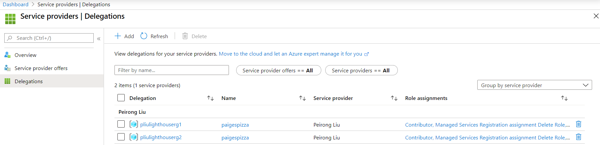

## The benefits and limitations of Azure Lighthouse 

### Why Azure Lighthouse 
If you are a service provider deploying or managing resources in your customers' Azure subscriptions, you typically would need to have the customers create or consent to create Service Principals in their respective Azure AD tenant, so that you can then use these Service Principals to log in to their tenant to perform operations.  [Azure Lighthouse](https://docs.microsoft.com/en-us/azure/lighthouse/overview), on the other hand, projects your customers' Azure resources into your tenant.  So you don't have to create service principals in their tenants.

Additionally, Lighthouse provides the service provider a view of all their customers and each customers' resources without having to signing in to the customers' tenant.  The customers also have a single view of their providers.  Both can revoke the link between them. 

Lighthouse does not dictate how you deploy the Azure resources.  You can still use Azure Resource Manager (ARM) templates, Terraform, Azure Cli, or any other tools of choice for deployment.  It's what credentials to use and how you get the permissions for the credentials that are different. 

For example, you can use customize [this ARM template](rgDRM.json) with [this parameter file](rgDRM_param.json).  By default, it requests the [permissions specified in the ARM template]() on [2 resource groups]() for a [group]() in your AAD tenant.  Once the subscription owner of your customer created these 2 resource groups and ran this ARM template, whoever, human user or service principal, is in the group will have these permissions to operate on the resource groups. 

In the Azure Portal, you as a service provider can search for "My Customers", and you will see this view of all your customers.  You can even navigate to their resources right there, without signing into their tenant.

As a customer, you can search for "Service Providers" in the Azure Portal, and see this view of all your service providers.  You can revoke their permissions here as well. 

If you add a service principal to your AAD group specified in the ARM template, you can use the service principal in Azure DevOps,  GitHub Actions, or any deployment tools to deploy Azure resources or applications. 

### Lighthouse Limitations (as of March 2020)
Lighthouse currently only provides control plane access to your customers' subscriptions, not data plane.  This has several implications:
*  The provider can’t access blob storage using AAD, for example, you can’t generate SAS URL with UserDelegationKey, which is a superior security practice compared to using storage account key.  The provider can still use storage account key to access customer's storage account.
*  The provider can’t store secrets in the customer's Key Vault for their applications to access.

You can fall back on to the traditional way of having your customers create service principals in their tenants for data plane access.

Lighthouse also currently doesn't work if the customer has Azure Databricks in their Azure subscriptions. 
