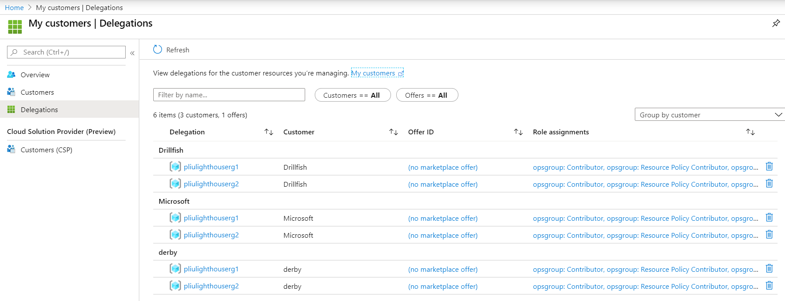

## The benefits and limitations of Azure Lighthouse 

### Why Azure Lighthouse 
If you are a service provider deploying or managing resources in your customers' Azure subscriptions, you typically would need to have your customers create or consent to create Service Principals in their respective Azure AD tenants, so that you can use these Service Principals to log in to their tenants to perform operations.  [Azure Lighthouse](https://docs.microsoft.com/en-us/azure/lighthouse/overview), on the other hand, projects your customers' Azure resources into your tenant.  So you don't have to create service principals in their tenants.

Additionally, Lighthouse provides the service provider a view of all their customers and each customers' resources without having to signing in to the customers' tenant.  Customers also have a single view of their providers.  The customer-provider relationship can also be revoked by either party. 

### How to use Azure Lighthouse
Lighthouse does not dictate how you develop or package your applications, or how you deploy applications and Azure resources.  You can use Azure Resource Manager (ARM) templates, Terraform, Azure Cli, or any other tool of choice for deployment.  It's what identities to use and how you get permissions for the identities that are different. 

For example, as a service provider, you can customize [this ARM template](rgDRM.json) with [this parameter file](rgDRM_param.json).  By default, it requests the [permissions specified in the ARM template](rgDRM_param.json#L22) on [2 resource groups](rgDRM.json#L61) for a [group](rgDRM_param.json#L20) in your own AAD tenant.  Once the subscription owner of your customer created these 2 resource groups and ran this ARM template, a human user or a service principal in this group will have these permissions to operate on the customer's resource groups. 

In the Azure Portal, as a service provider you can search for "My Customers", and see this view of all your customers.  You can even navigate to their resources right there, without signing into their tenant.



As a customer, you can search for "Service Providers" in the Azure Portal, and see this view of all your service providers.  You can revoke their permissions here as well. 


You can add a service principal to your AAD group specified in the ARM template, and use it in Azure DevOps,  GitHub Actions, or any deployment tools to deploy Azure resources or applications. 

### What if my applications need to access data in Azure Storage, or secrets in Azure Key Vault? 
As of Mar 2020, Lighthouse only provides control plane access to your customers' subscriptions, not data plane.  However a provider can still assign [Managed Service Identity](https://docs.microsoft.com/en-us/azure/active-directory/managed-identities-azure-resources/overview) (MSI) necessary roles to access, for example, Azure Blob Storage and Azure Key Vault.  To do this, a provider needs to:
1. Request the roles they need to assign to MSI in the ```delegatedRoleDefinitionIds``` section of the ```User Access Administrator (18d7d88d-d35e-4fb5-a5c3-7773c20a72d9)``` role.  See an example [here](https://github.com/Azure/Azure-Lighthouse-samples/blob/master/Azure-Delegated-Resource-Management/templates/delegated-resource-management/delegatedResourceManagement.parameters.json#L40).
2. Create a role assignment for the MSI of an Azure resource, for example a VM or a Web App, to access data.  See an example [here](https://github.com/Azure/Azure-Lighthouse-samples/blob/master/Azure-Delegated-Resource-Management/templates/policy-add-or-replace-tag/addOrReplaceTag.json#L71)
3. //TODO: add an example of MSI role assignment on a Storage Account and Container. 
4. //TODO: add an example of MSI role assignment on a Key Vault. 

>*NOTE*: Although Lighthouse currently doesn't support data plane operations on Azure Storage Account, a provider could still access data with a Storage Account Key.  This is because [listing Storage Account Keys is a control plane operation](https://docs.microsoft.com/en-us/azure/storage/common/authorization-resource-provider?toc=/azure/storage/blobs/toc.json#built-in-roles-for-management-operations).  The MSI approach is superior in security and should be used when possible. 
