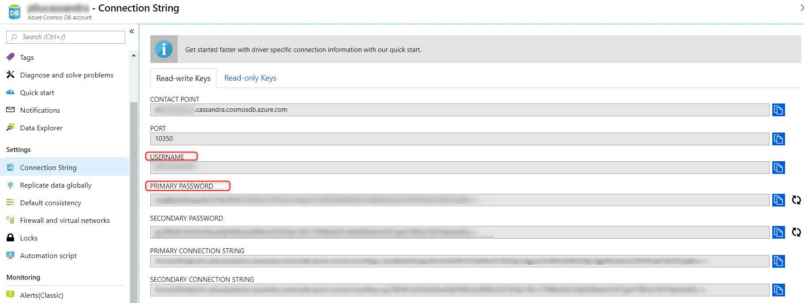

## Connecting cqlsh and cassandra-stress to Azure Cosmos DB Cassandra API

Azure Cosmos DB Cassandra API is CQL v4 wire protocol compliant. Most CQL tools and Cassandra drivers can work with Cosmos DB Cassandra API without any code change. However, it could be a bit confusing to configure SSL correctly to connect these tools to Cosmos DB. Here we'll take a look at how to connect cqlsh and cassandra-stress to Cosmos DB.

### Without SSL validation

When you use SSL to connect to an endpoint, in this case Cosmos DB Cassandra API, if you don't need to verify that the service endpoint is indeed who it says it is, then all you need to do to connect cqlsh to Cosmos DB is the following:

```sh
export SSL_VERSION=TLSv1_2
export SSL_VALIDATE=false
cqlsh <YOUR_ACCOUNT_NAME>.cassandra.cosmosdb.azure.com 10350 -u <YOUR_ACCOUNT_NAME> -p <YOUR_ACCOUNT_PASSWORD> --ssl
```

You can find your Cosmos DB account name and account password in the Azure Portal:


Obviously in production you should enable SSL validation. Also, cassandra-stress doesn't have the option to disable SSL validation. 

### With SSL validation

Applications that use Azure services need to trust the Baltimore CyberTrust root certificate. Check if this certificate is already installed in your system:
```sh
keytool -list -keystore $JAVA_HOME/lib/security/cacerts
# default password for the keystore is "changeit"
# check if a there's a certificate with thumbprint: 
#   d4:de:20:d0:5e:66:fc:53:fe:1a:50:88:2c:78:db:28:52:ca:e4:74
```

If the certificate is not already installed, download and import it to Java trust store: 
```sh
wget https://cacert.omniroot.com/bc2025.crt
mv bc2025.crt bc2025.cer
keytool -keystore $JAVA_HOME/lib/security/cacerts -importcert -alias bc2025ca -file bc2025.cer
```

To connect cqlsh to Cosmos DB with SSL validation, create a PEM key:
```sh
keytool -importkeystore -srckeystore $JAVA_HOME/lib/security/cacerts -destkeystore user.p12 -deststoretype PKCS12
openssl pkcs12 -in user.p12 -out user.pem -nodes
export SSL_VERSION=TLSv1_2
export SSL_CERTFILE=user.pem
# SSL_VALIDATE is by default true, so either set it to true, or "unset SSL_VALIDATE"
export SSL_VALIDATE=true
cqlsh <YOUR_ACCOUNT_NAME>.cassandra.cosmosdb.azure.com 10350 -u <YOUR_ACCOUNT_NAME> -p <YOUR_ACCOUNT_PASSWORD> --ssl
```

To connect cassandra-stress to Cosmos DB with SSL validation, you don't need a PEM key, but you do need to specify the trust store:
```sh
export SSL_VERSION=TLSv1_2

# "changeit" is the default password for the Java trust store, verify by running the list command
keytool -list -keystore $JAVA_HOME/lib/security/cacerts

cassandra-stress write n=10 -node <YOUR_ACCOUNT_NAME>.cassandra.cosmosdb.azure.com -port native=10350 -transport ssl-protocol=TLSv1.2 factory=org.apache.cassandra.thrift.SSLTransportFactory truststore=$JAVA_HOME/lib/security/cacerts truststore-password=changeit -mode native cql3 user=<YOUR_ACCOUNT_NAME> password=<YOUR_ACCOUNT_PASSWORD>
```

Happy cqlsh and cassandra-stress against Azure Cosmos DB Cassandra API. 