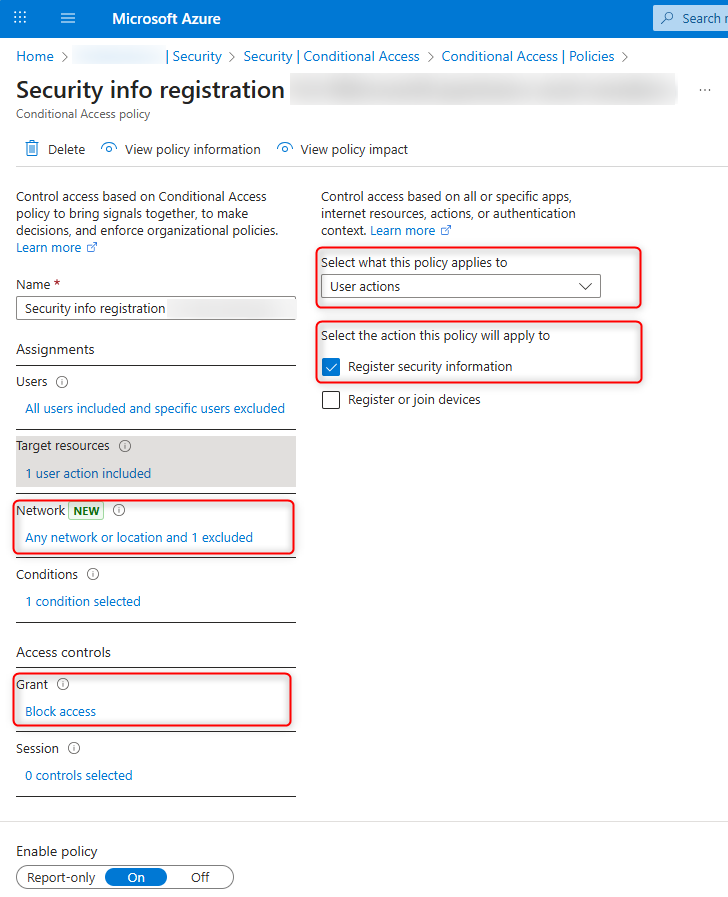

# Troubleshooting Entra ID new user log in failure

When you create a new local user in Entra ID, sometimes the
user can successfully log in with the temporary password,
but fail to set up MFA with the following error message:

>__You cannot access this right now__  
Your sign-in was successful but does not meet the criteria to access this resource. For example, you might be signing in from a browser, app, or location that is restricted by your admin.

While all troubleshooting guides immediately point to Entra ID
`Conditional Access Policies`, it's not easy to find a fix even
with the help of the `What if` tool that Entra ID provides.

The error is caused by the `Conditional Access Policies` that either
require MFA to access the site where the user needs to set up MFA
to begin with, or preventing the user from access the site to set
up MFA.

In our case, the tenant has two policies:

- MFA is enabled for `all users` targeting `all cloud apps`, but not
enabled for `user actions`. __Registering MFA is considered a `user action`__,
so this policy shouldn't prevent the user from registering MFA.
- Another policy is set to deny `all users` access to
the `Register security info` `user action` except from a
specific IP range. This is the policy that
applies when a new user tries to set up MFA.

In this case, the user doesn't have control over the IP range they
can set up MFA. By temporarily excluding the user from the security
info registration policy, they can set up MFA from an IP address not
in the allowed range. Immediately after they have MFA set up,
remove them from the exclusion list.
