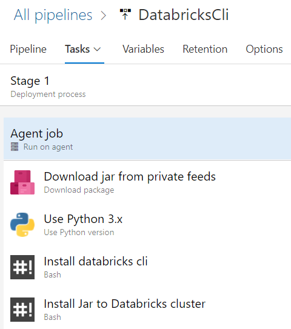
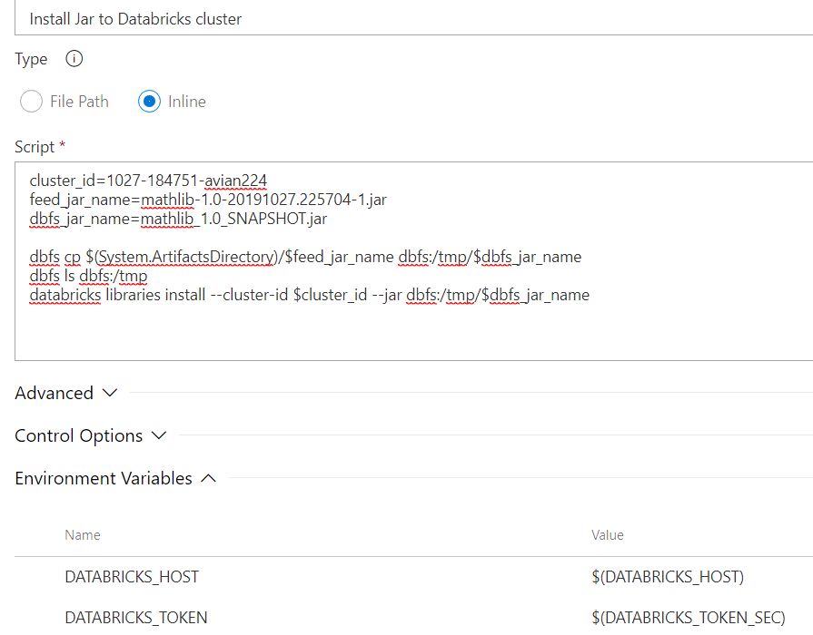

## Install jars from an Azure DevOps private feed to an Azure Databricks cluster

Databricks [cli](https://docs.azuredatabricks.net/dev-tools/api/latest/index.html) or [REST API](https://docs.azuredatabricks.net/dev-tools/api/latest/index.html) lets you install custom jars from dbfs or Maven repository. But if your jars are in a private [Azure DevOps feed](https://azure.microsoft.com/en-us/services/devops/artifacts/), there isn't a way to provide the token for Databricks to access the feed.  Instead, you can automate this in an Azure DevOps pipeline as demonstrated below.  

In Azure DevOps, create a release pipeline that runs on hosted ubuntu agent and consists of the following tasks:


1. __Download packages__ - this is an Azure DevOps built-in task that lets you specify the artifacts in Azure DevOps feeds and download to a staging location, by default, ```$(System.ArtifactsDirectory)```.
2. __Specify Python version__ - Databricks cli has dependency on Python. Run this task to specify we are using Python 3. 
3. __Install Databricks cli__ - This is simply an inline bash script that runs ```pip install databricks-cli```. Note that we are not configuring the Databricks cli to connect to our Databricks workspace yet, because the environment is specific to each bash script, and will not be carried on to subsequent bash scripts.
4. __Install jar to Databricks__ - with Databricks cli installed, we need to set the 2 environment variables, ```DATABRICKS_HOST``` and ```DATABRICKS_TOKEN``` as documented [here](https://docs.azuredatabricks.net/dev-tools/databricks-cli.html#set-up-authentication), to connect to a Databricks workspace.  Now we can run any Databricks cli command to manage the workspace, including installing libraries to clusters. To install the jar that was downloaded in Task 1, we can run the following inline bash script:
```bash
cluster_id="my_cluster_id"
feed_jar_name="my_downloaded_jar_filename"
dbfs_jar_name="my_uploaded_dbfs_jar_filename"

dbfs cp $(System.ArtifactsDirectory)/$feed_jar_name dbfs:/tmp/$dbfs_jar_name
dbfs ls dbfs:/tmp
databricks libraries install --cluster-id $cluster_id --jar dbfs:/tmp/$dbfs_jar_name
``` 
Here's what this task looks like:


### Several things to note that may not be obvious -  

1. Databricks cluster id is not the same as cluster name. One way to get it is by navigating to your cluster and look in the URL:

2. The file name that you downloaded from the feed is not the same as the file name you published. It's augmented with datetime info.  Note also that trying to run the bash script in ```$(System.ArtifactsDirectory)``` will cause the agent to hang. So you need to specify the file path in the script.
3. It's probably more common to programmatically install a jar to a Databricks job cluster rather than an interactive cluster due to the nature that jobs are typically automated.  You can specify jars that you uploaded to dbfs in the [create job](https://docs.azuredatabricks.net/dev-tools/api/latest/jobs.html#create) REST API or cli. 
