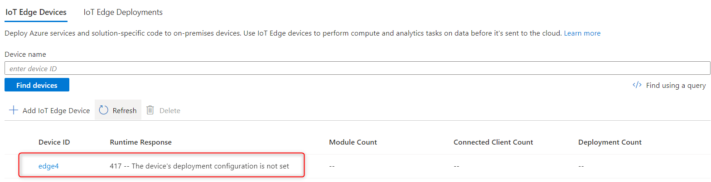
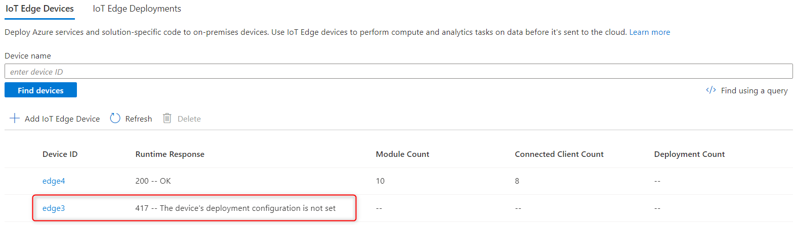

# How to update expired certificates on Azure IoT Nested Edge

If you use X.509 certificates to establish trust between Azure IoT Edge devices and IoT Hub, or between child and parent devices in nested edge scenarios, updating the certificates manually is a non-trivial task and also could cause downtime. This is because the certificate thumbprint of an IoT Edge device cannot be updated once registered. This article describes the manual processes for updating certificates in the Azure IoT Nested Edge scenario with one parent device that connects to Azure IoT Hub and one child device that doesn't have Internet access.


## Step 1: Prepare new certificates
Similar to provisioning a new nested edge environment, the following certificates are needed:
* identity certificate and key for the parent edge to authenticate to IoT Hub
* identity certificate and key for the child edge to authenticate to IoT Hub through its parent
* edge CA certificate and key for the child edge to trust its parent
* root CA certificate that's used to sign other certificates if it's also updated

If you name these certificates exactly the same as the existing certificates and place them in the same folders on both edge devices, then you don't need to change the content of the IoT Edge configuration file `/etc/aziot/config.toml`.

## Step 2: Remove old certificates from edge devices
On each edge device:

1. Stop IoT Edge `sudo iotedge system stop`.
2. Delete existing certificates. This step is *critical* to the successful update of certificates.
```bash
sudo rm -rf /var/lib/aziot/certd/certs
sudo rm -rf /var/lib/aziot/keyd/keys
```

## Step 3: Install new certificates
On each edge device:

1. If the root CA certificate is updated, replace and trust the new root CA certificate, for example, 
```bash
sudo cp /path/to/ca_cert.pem /usr/local/share/ca-certificates/ca_cert.pem.crt
sudo update-ca-certificates
```
2. Copy and replace the identity cert for the edge device in the same location as before.
3. On parent edge only, copy and replace the edge CA certificates in the same location as before. 
4. Take a backup of the deployment manifest of the edge device.
5. Delete the edge device from IoT Hub.

## Step 4: Restore the parent edge
1. Re-register the parent edge device in IoT Hub with its new identity certificate thumbprint.
```bash
# retrieve thumbprint from certificate
openssl x509 -in /path/to/identity_cert.pem -text -fingerprint | sed 's/[:]//g'
```
2.  Start iotedge ```sudo iotedge config apply```. After a few seconds, you should see the parent edge successfully registered with IoT Hub. But there's no deployment yet.



> If the parent edge cannot register with IoT Hub, recreate the edge containers as following:
```bash
sudo iotedge system stop
sudo docker rm edgeAgent
sudo docker rm edgeHub
sudo iotedge system restart
```

3. Deploy modules using the deployment manifest saved at Step 3.4:
```bash
az iot edge set-modules --hub-name {iothub_name} --device-id {parent_device_id} --content {/path/to/deployment_manifest.json}
```
The parent edge should now be healthy.


## Step 5: Restore the child edge
1. Re-register the child edge device in IoT Hub with its new identity certificate thumbprint. Remember to set the parent child relationship in IoT Hub.
```bash
# retrieve thumbprint from certificate
openssl x509 -in /path/to/identity_cert.pem -text -fingerprint | sed 's/[:]//g'
```
2.  Start iotedge ```sudo iotedge config apply```. After a few seconds, you should see the child edge successfully registered with IoT Hub. But there's no deployment yet.



> If the child edge cannot register with IoT Hub, recreate the edge containers as following:
```bash
sudo iotedge system stop
sudo docker rm edgeAgent
sudo docker rm edgeHub
sudo iotedge system restart
```
3. Deploy modules to the child edge using the deployment manifest saved at Step 3.4:
```bash
az iot edge set-modules --hub-name {iothub_name} --device-id {child_device_id} --content {/path/to/deployment_manifest.json}
```

## Summary
Updating expired or soon-to-expire certificates in nested edge scenarios is an involved process. Invest in automation to manage such environment at scale and reduce downtime.
