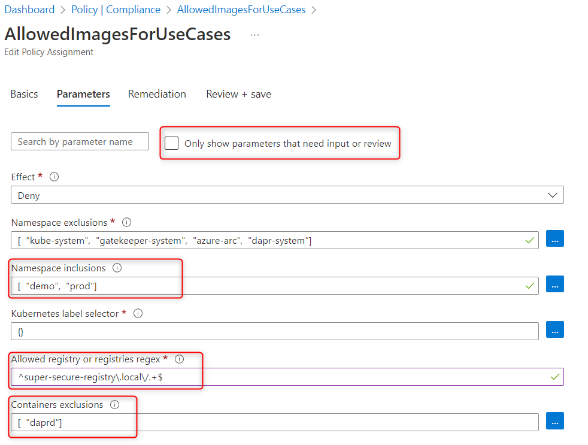

# Overview

[Azure Policy extension](https://learn.microsoft.com/en-us/azure/governance/policy/concepts/policy-for-kubernetes) for Azure Arc enabled Kubernetes lets you centrally manage compliance of your Kubernetes clusters. In this example, we walk through how to ensure our cluster only uses docker images from approved container registry.

## How it works

Here are the main steps to enable policy on Arc managed Kubernetes clusters. You can find the complete tutorial [here](https://learn.microsoft.com/en-us/azure/governance/policy/concepts/policy-for-kubernetes).

1. Install Azure Policy Extension:

```bash
az k8s-extension create --cluster-type connectedClusters --cluster-name <CLUSTER_NAME> --resource-group <RESOURCE_GROUP> --extension-type Microsoft.PolicyInsights --name <EXTENSION_INSTANCE_NAME>
```

2. Assign a policy definition as documented [here](https://learn.microsoft.com/en-us/azure/governance/policy/concepts/policy-for-kubernetes#assign-a-policy-definition). In this case we select a policy called `Kubernetes cluster containers should only use allowed images`. When configuring the policy assignment, you can specify which namespaces to apply the policy as well as exceptions as shown below:



3. Check the policy status in the cluster.

It takes 15 minutes or so for the policy to be synced to the cluster and evaluated. Run the following commands to show the policy violations.

```bash
kubectl get constrainttemplates
kubectl get k8sazurev2containerallowedimages
kubectl get k8sazurev2containerallowedimages azurepolicy-k8sazurev2containerallowedimag-<id> -o yaml 
```

You can also go to the Azure Portal to see all the [policy compliance status](https://ms.portal.azure.com/#view/Microsoft_Azure_Policy/PolicyMenuBlade/~/Compliance).  

4. Try deploy a pod using an image from an un-approved container registry, and you will see it's blocked.

```bash
> kubectl run busybox -it --rm --restart=Never --image=busybox --namespace demo -- /bin/bash
Error from server (Forbidden): admission webhook "validation.gatekeeper.sh" denied the request: [azurepolicy-k8sazurev2containerallowedimag-<id>] Container image busybox for container busybox has not been allowed.
```
