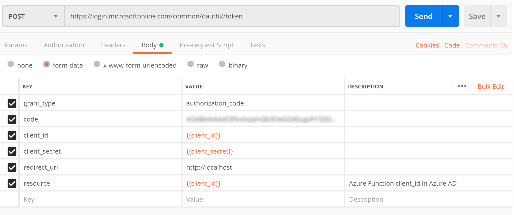
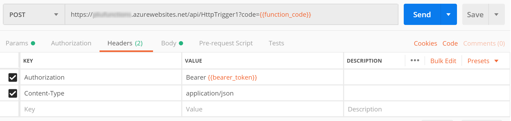
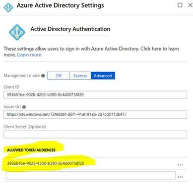
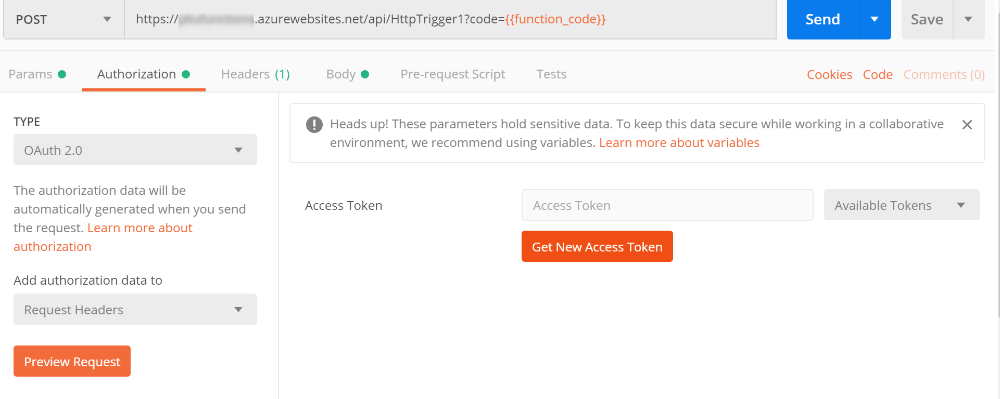
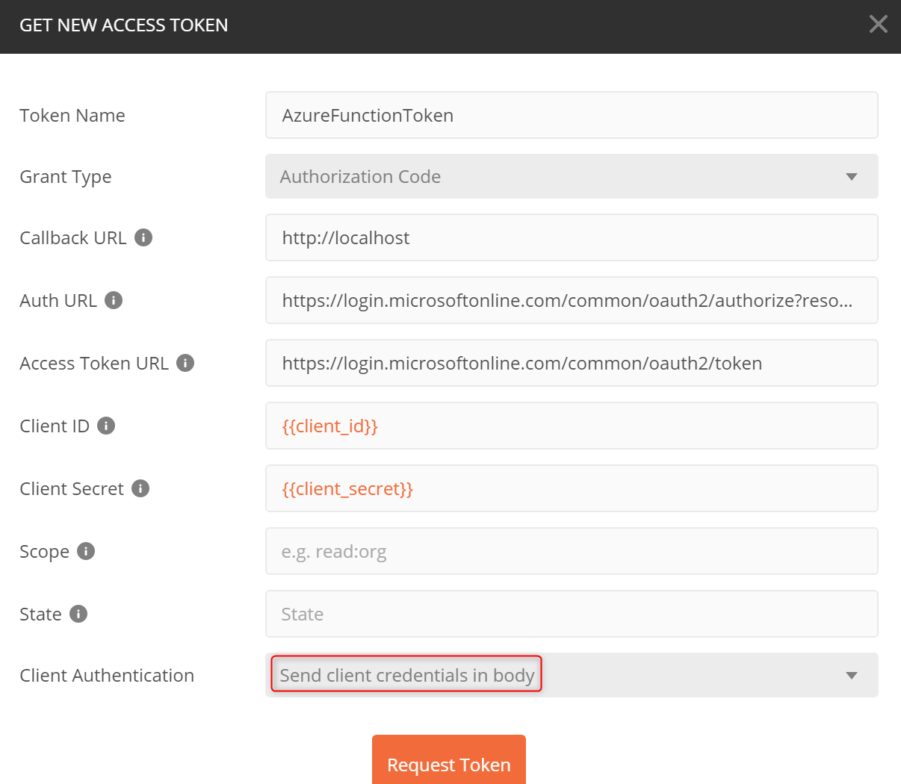

## Using Postman to access Azure Active Directory protected Azure Functions

You can enable Azure Active Directory authentication on Azure Functions in the Azure portal without having to write any code. Navigate to Function app, __Platform features__, then __Authentication/Authorization__:


You can then configure different authentication providers. Here we choose Azure Active Directory (AD). Follow the UI wizard to complete the configuration. __client_id__ below refers to the client id of the application you registered in Azure AD for this Function app.

Assuming your Function uses HTTP trigger, you can access the Function from Postman in two ways. 

### Use a browser to get access code
1. In the browser, issue a request ```https://login.microsoftonline.com/common/oauth2/authorize?client_id=<client_id>&response_type=code&redirect_uri=http://localhost```. Make sure http://<span></span>localhost is one of the registered reply URLs. 
2. The browser will redirect back with a "code" parameter in the URL. Copy the value of this parameter.
3. In Postman, make a POST request. The value of the "code" parameter is the value you copied from the previous step. Copy the "access_token" from the response.
 
4. In Postman, make a POST request with the "access_token":

You can get the URL of your function from the Azure portal. 

### Use Postman OAuth2 
With Postman OAuth2, you can authenticate within Postman entirely without a browser. I verified that multi-factor authentication also works with username/password plus mobile authentication, but using a smartcard doesn't work at the time of writing (Jan 2019).
1. Go to your Function App in Azure portal, __Authentication / Authorization__, __Azure Active Directory__, turn on __Advanced__ option, and add the __client_id__ of the Function app to __ALLOWED TOKEN AUDIENCES__:


2. Compose a call to Azure Function in Postman, then choose __Authorization__ tab, and __OAuth 2.0__ to get an access token:


3. Fill in the values in the OAuth2 screen, make sure:
    * __Callback URL__ must be registered in your Azure AD app as one of the reply URLs
    * __Auth URL__ must include a "resource" parameter which can be the same as the __client_id__ of Function app, for example, ```https://login.microsoftonline.com/common/oauth2/authorize?resource=client_id```
    * __Scope__ and __State__ can be empty
    * __Client Authentication__ should be set to __Send client credentials in body__.  This is the mode supported by AAD. 


4. Use the obtained token to make the call.
