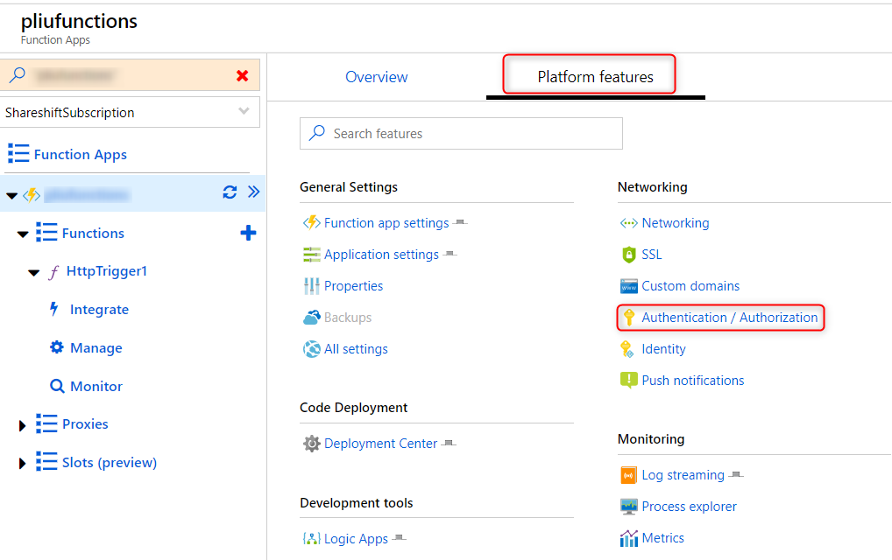

## Using Postman to access Azure Active Directory protected Azure Functions

You can enable Azure Active Directory authentication on Azure Functions in the Azure portal without having to write any code. Navigate to Function app, __Platform features__, then __Authentication/Authorization__:


You can then configure different authentication providers. Here we choose Azure Active Directory. Follow the UI wizard to complete the configuration. 

Assuming your function uses HTTP trigger, you can access the function from Postman in two ways. 

### Use a browser to get access code
1. In the browser, issue a request ```https://login.microsoftonline.com/common/oauth2/authorize?client_id=<your_registered_aad_app_id>&response_type=code&redirect_uri=http://localhost```. Make sure http://localhost is one of the registered reply URLs. 
2. The browser will redirect back with a "code" parameter in the URL. Copy the value of this parameter.
3. In Postman, make a POST request. The value of the "code" parameter is the value you copied from the previous step. Copy the "access_token" from the response. 
4. In Postman, make a POST request with the access_token:
You can get the code of your function from the Azure portal. 

### Use Postman OAuth2 
