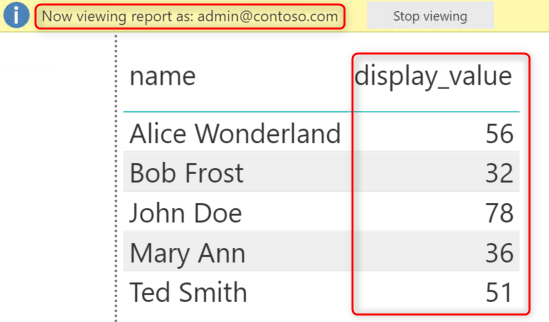
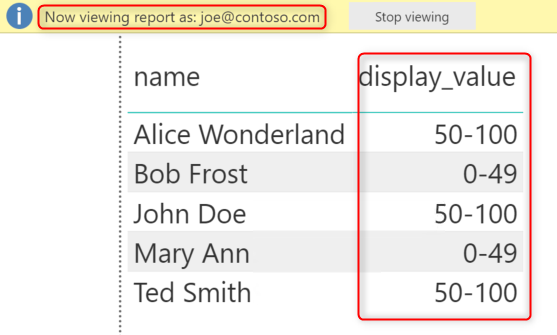
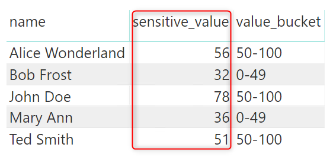
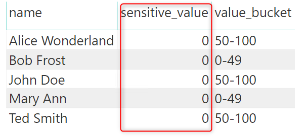

## Display different columns in Power BI based on logged in user 

Suppose you have the following table of data, let's call this table ```datatable```: 

|name             |sensitive_value  |
|---              |---              |
|Alice Wonderland |56               |
|Bob Frost        |32               |
|John Doe         |78               |
|Mary Ann         |36               |
|Ted Smith        |51               |

For privileged users, you would like to display the ```sensitive_value``` as-is in Power BI, while for non-privileged users, you would like to display the values in buckets as shown in the ```value_bucket``` column below: 

|name             |sensitive_value  |value_bucket    |
|---              |---              |---             |
|Alice Wonderland |56               |50-100          |
|Bob Frost        |32               |0-49            |
|John Doe         |78               |50-100          |
|Mary Ann         |36               |0-49            |
|Ted Smith        |51               |50-100          |

I have tried two ways to achieve this. 

### Option 1 - Create a measure to display based on username() 
This approach is fairly simple and works for both Power BI Service and Power BI Embedded. 
1.  Create a measure for ```value_bucket``` based on ```sensitive_value```:
```
value_bucket = if('datatable'[sensitive_value] < 50, "0-49", "50-100")
```
2.  Create a table, called ```usertable```, that contains the users who can see ```sensitive_value``` as-is:

|username                |
|---                     |
|admin@contoso.com       |
|pbiadmin@contoso.com    |

3.  Create a measure to display either ```sensitive_value``` or ```value_bucket``` based on username()
```
display_value = 
    var showvalue = IF(CONTAINS(usertable,usertable[username], USERNAME()), 1, 0)
    return if(showvalue = 1, max('datatable'[sensitive_value]), max('datatable'[value_bucket]))
```
4.  Hide ```sensitive_value```, ```value_bucket```, and ```usertable``` in Power BI. 

You can now test what different users will see in Power BI Desktop using ```View as Roles```:



### Option 2 - User Azure SQL or SQL Server Dynamic Data Masking
If your data source is Azure SQL or SQL Server, and Power BI connects to SQL with Direct Query using Azure AD authentication with user's credential, then you could leverage the [Dynamic Data Masking](https://docs.microsoft.com/en-us/azure/sql-database/sql-database-dynamic-data-masking-get-started) capability in SQL Server.  This approach masks the data directly at the data source level, potentially reducing the exposure of sensitive data, but it has several limitations in addition to having to have Direct Query and Azure AD authentication:
1. It doesn't work with Power BI Embedded, because the end user is not a Power BI user, and Power BI would pass the master user's credential to SQL instead. 
2. Creating a measure of ```value_bucket``` in Power BI based on the masked ```sensitive_value``` won't work, because the query results coming from SQL to Power BI is already masked, the measure will see all numeric values as 0. You must create a computed column in SQL instead.  

Here's what you need to do to integrate dynmaic data masking with Power BI:
1.  Assuming you have the same ```datatable``` in Azure SQL Database, [configure Dynamic Data Masking](https://docs.microsoft.com/en-us/azure/sql-database/sql-database-dynamic-data-masking-get-started-portal) on the ```sensitive_value``` column. Note that you must configure masking before adding a computed column based on the masked column, otherwise, masking configuration will fail. 
2.  Create a computed column ```value_bucket``` based on ```sensitive_value```:
```sql
ALTER TABLE datatable add value_bucket as (case when sensitive_value < 50 then '0-49' else '50-100' end)
```
3.  Log in to SQL as an Azure AD admin of the SQL DB, and grant users access to the database:
```sql
CREATE USER [pbiadmin@contoso.com] FROM  EXTERNAL PROVIDER  WITH DEFAULT_SCHEMA=[dbo]
CREATE USER [joe@contoso.com] FROM  EXTERNAL PROVIDER  WITH DEFAULT_SCHEMA=[dbo]
GRANT SELECT on SCHEMA :: dbo TO [pbiadmin@contoso.com];
GRANT SELECT on SCHEMA :: dbo TO [joe@contoso.com];
```
4.  Create a report in Power BI that displays both ```sensitive_value``` and ```value_bucket```:
5.  Publish the report to Power BI Service, and configure Power BI to connect to SQL using user's Azure AD credential:


As different users sign in to Power BI to view the report, those who are exempted from Dynamic Data Masking will see  ```sensitive_value``` as-is, 

others will see 0 in this column. 
