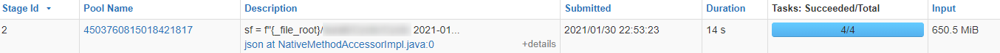
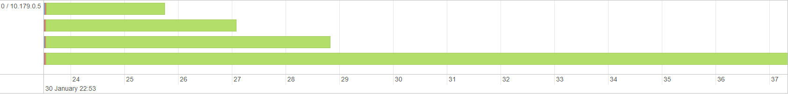

# Reading large single line json file in Spark

In a recent project, we need to read json files in Databricks. Each of these json files is about 250MB and contains only a single line. All the data is nested in the json string. Several problems surfaced that were hard to explain.

## The symptoms

Even though the Databricks cluster was configured such that each worker node (executor) has 5X to 10X the memory of the size of all the files to read, the job still frequently experienced following errors:

```text
Lost task 5.0 in stage 77.0 (TID 463, 10.179.0.6, executor 0): com.databricks.sql.io.FileReadException: Error while reading file <redacted>.json.
...
Caused by: java.lang.OutOfMemoryError: Java heap space
...
```

or,

```text
Lost task 5.3 in stage 77.0 (TID 486, 10.179.0.6, executor 4): ExecutorLostFailure (executor 4 exited caused by one of the running tasks) Reason: Remote RPC client disassociated. Likely due to containers exceeding thresholds, or network issues. Check driver logs for WARN messages.
```

Another symptom is that assigning more machines or more powerful machines to the cluster didn't help, on the contrarary, it seemed to exerbate the problem. For example, when allocating 2 Azure DS12 VMs, each with 28GB memory and 4 cores, the job failed less often than 2 DS14 VMs, each with 112GB memory and 16 cores.

## The cause

What finally stood out during investigation was that when the job was reading these json files from Azure blob storage, egress was unexpectedly high, often 10X the total file size. Although there was no throttling error on Azure Blob Storage, there were spikes of failed requests when the job is running.

Note that these are single line json files. Even though the line is extremely long, it's not required to set the `multiline` flag of DataFrameReader to `true` when reading json. However, it turns out when `multiline` is `false (default)`, Spark will attempt to chunk the json file in order to read it in parallel tasks.

The below picture shows how Spark reads a single file of 262MB with a single worker node of 4 CPU cores. Databricks tries to split the file into 4 chunks so that each CPU core, or task, attempts to read 1, 2, 3, 4 chunks respectively. It only succeeded when reading all 4 chunks to get a single record, the rest 3 tasks didn't get any record. In total, it reads 650MB, even though the file is only 262MB.





The following picture shows how it reads the same file with 2 worker nodes, each with 4 CPU cores. This time Spark attempts to split the file into 8 chunks, but again only succeeded to get a single record when reading the whole file. In total, the 8 tasks read 1167MB even though the file is 262MB, almost twice as inefficient as when there's only one worker node.


The actual Databricks job reads dozens of such json files at once. resulting in over 70GB/s egress as seen in blob storage performance chart, way above the [advertised 50Gbps throughput limit](https://docs.microsoft.com/en-us/azure/azure-resource-manager/management/azure-subscription-service-limits#storage-limits). This possibly caused executors to timeout or run out of memory.

## The solution

The problem is solved by setting `multiline` to `true`, which tells Spark the json file can't be split. As shown in the following picture, Spark now only reads the file once.


> Known issue - when `multiline` is set to `true`, file names must not contain ":", otherwise, you'll get an error `java.net.URISyntaxException: Relative path in absolute URI`, because of [this issue](https://issues.apache.org/jira/browse/HADOOP-14217).
